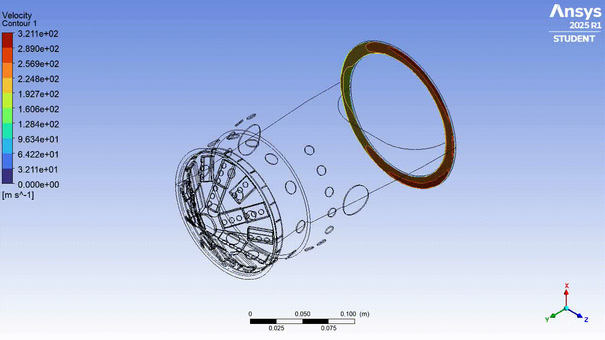

## Overview
This project focuses on the CFD simulation of a combustion chamber, specifically the **Rolls-Royce Allison 250** combustion chamber. The study is supported by two real turbine units located at the [*Laboratorio de Técnicas Aeroespaciales*](https://fi.udec.cl/laboratorios/aerodinamica/) of the **Universidad de Concepción**.

  
  

## Objetives
- Develop accurate geometries and computational meshes of the combustion chamber.  
- Perform CFD simulations using **Ansys Fluent** to evaluate flow characteristics.  
## Software & Tools
- SpaceClaim: Geometry modeling.
- Fluent with Meshing: Grid generation, CFD simulation and post-processing
