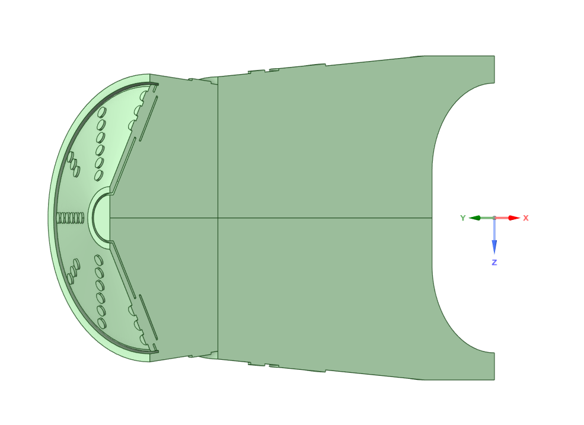

# Geometry and Domain
The geometry was obtained by carefully measuring the **liner** of the combustion chamber (see [Figure 1](#figure-1-geometry)). The liner consists of three distinct zones:
- **Dome Swirler:** Introduces turbulence to enhance fuel-air mixing.
- **Primary Zone:** The region where combustion occurs.
- **Dilution Zone:** Where the exhaust gases are cooled before exiting the chamber.

The internal fluid domain was generated by revolving the chamber’s silhouette around the y-axis to create a solid, followed by using the *Combine* tool to subtract the chamber walls (see [Figure 2](#figure-2-fluid-domain)). Check the .stp file [*here*](docs/images/Liner.stp)!

  
  
  <a id="figure-1-geometry"><strong>Figure 1. Geometry</strong></a>  

  
  
  <a id="figure-2-fluid-domain"><strong>Figure 2. Fluid Domain</strong></a>  

