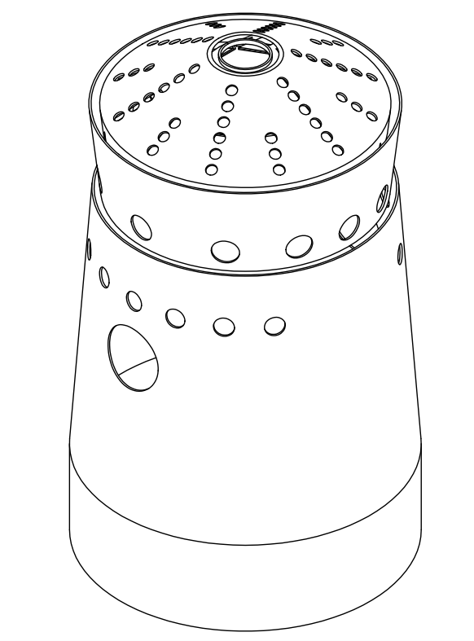

# Geometry
The geometry corresponds to the **liner** of the combustion chamber, which consists of three distinct zones:
- **Dome Swirler:** Introduces turbulence to enhance fuel-air mixing.
- **Primary Zone:** The region where combustion occurs.
- **Dilution Zone:** Where the exhaust gases are cooled before exiting the chamber.

Check the .stp file [*here*](docs/images/Liner.stp)!

  

