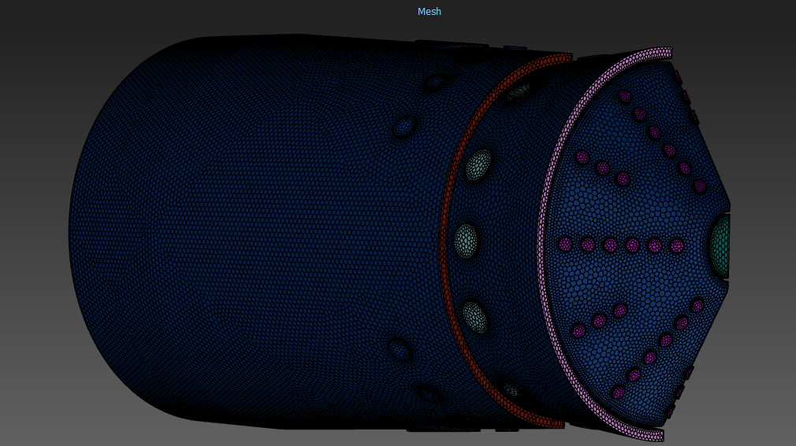

# Mesh and Named Selections

  

  

- **inlet_cooling_1:** Light pink annular ring.  
- **inlet_cooling_2:** Red annular ring.  
- **inlet_combustion:** Perforations located between the cooling inlets.  
- **inlet_dil_1:** Openings situated below the combustion inlet.  
- **inlet_dil_2:** Openings located below dilution 1, positioned at the top and bottom.  
- **inlet_fuel:** Main large centered hole on the right side.  
- **inlet_swirler:** Bright pink array of small holes located below the fuel inlet.  
- **outlet:** Shown in *Figure 3*.  
- **symmetry:** Orange-highlighted surface shown in *Figure 1*.  

