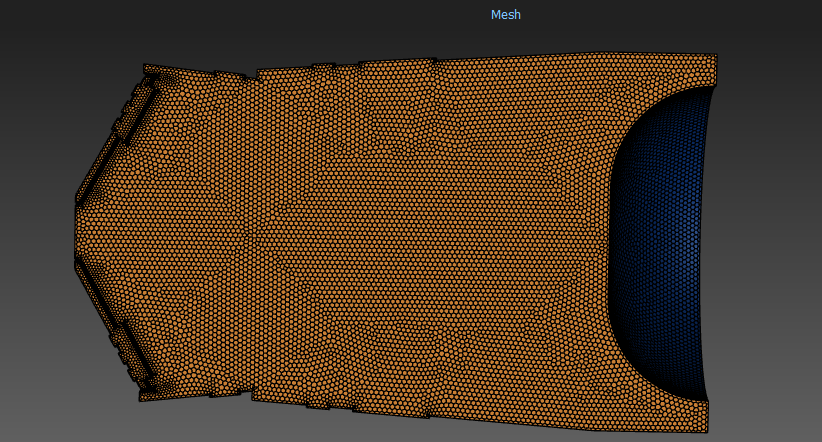

# Mesh 
## Mesh Configuration
The surface mesh size is 0.001 [m] and the maximum size is 0.002 [m] with a growth rate of 1.2.
### Geometry Description
- The geomtry consists of only fluid regions with no voids
- Change all fluid-fluid regions boundary types from "wall" to "internal"?: No
- Do you want to apply Share Topology?: No
- Enable multizone meshing?: No
  
### Boundary Conditions
- Inlets: As **Velocity Inlet** 
- Outlet: As **Pressure Outlet**.  
- Symmetry planes: Applied as indicated in the figures below. 

## Named Selections and Volume Mesh

  
  
  <a id="figure-1-mesh-2"><strong>Figure 1. Named Selections</strong></a>  

- **inlet_cooling_1:** Light pink annular ring.  
- **inlet_cooling_2:** Red annular ring.  
- **inlet_combustion:** Perforations located between the cooling inlets.  
- **inlet_dil_1:** Openings situated below the combustion inlet.  
- **inlet_dil_2:** Openings located below dilution 1, positioned at the top and bottom.  
- **inlet_fuel:** Main large centered hole on the right side.  
- **inlet_swirler:** Bright pink array of small holes located below the fuel inlet.  
- **symmetry:** Orange-highlighted surface shown in *Figure 2*.
- **outlet:** Shown in *Figure 3*.  

  
  
  <a id="figure-2-mesh-1"><strong>Figure 2. Symmetry</strong></a>  

  
  
  <a id="figure-3-mesh-3"><strong>Figure 3. Outlet</strong></a>  

## Mesh quality
Total number of cells: 368822

  
| Aspect Ratio (max) | Skewness (max/avg) | Orthogonal Quality (min) |
|--------------------|---------------------|-------------------------|
| 15                 | 0.79963 / 0.03129   | 0.2                    |

