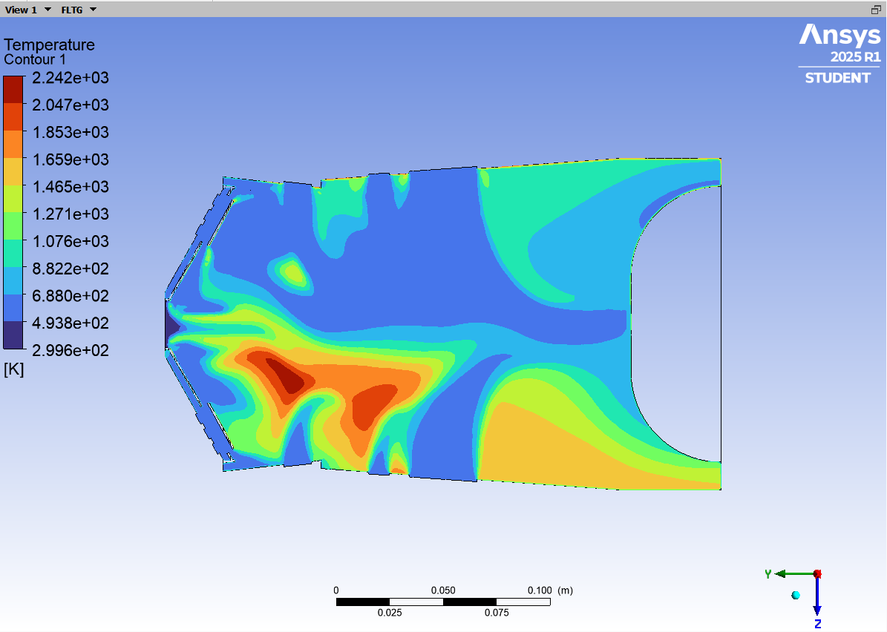

  
  
  <a id="figure-1-mesh-2"><strong>Figure 1. Temperature</strong></a>  

  
  
  <a id="figure-1-mesh-2"><strong>Figure 2. Pression</strong></a>  

  
  
  <a id="figure-1-mesh-2"><strong>Figure 3. Velocity</strong></a>  

